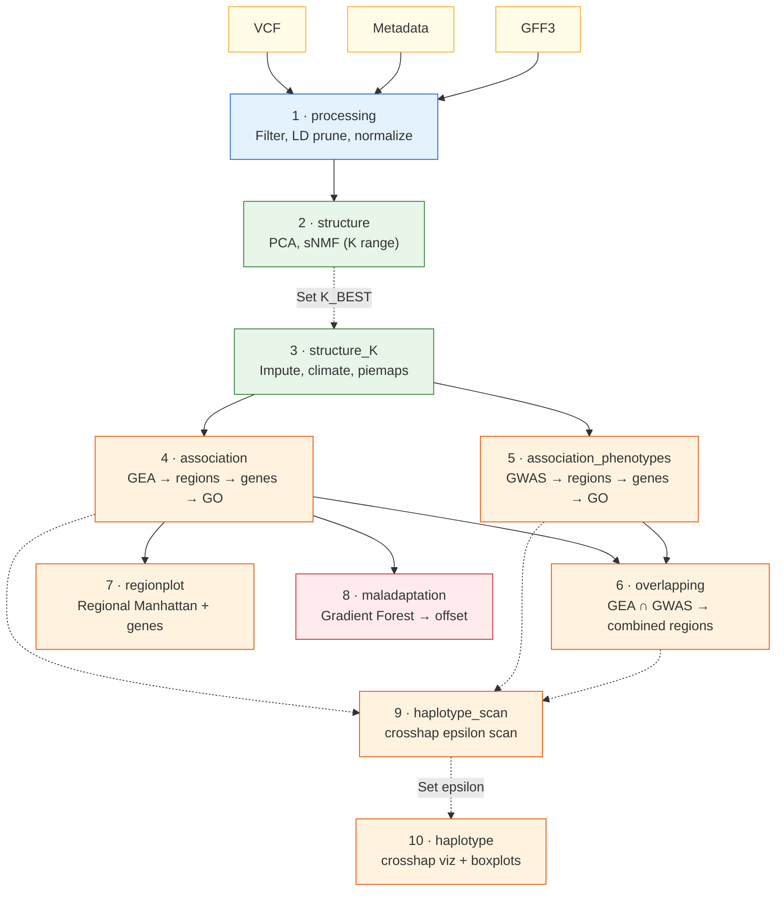
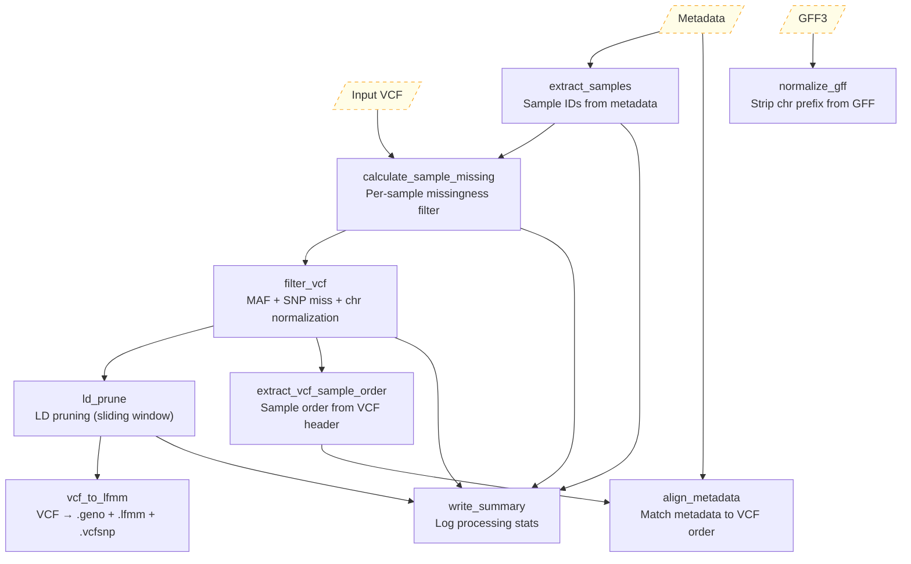
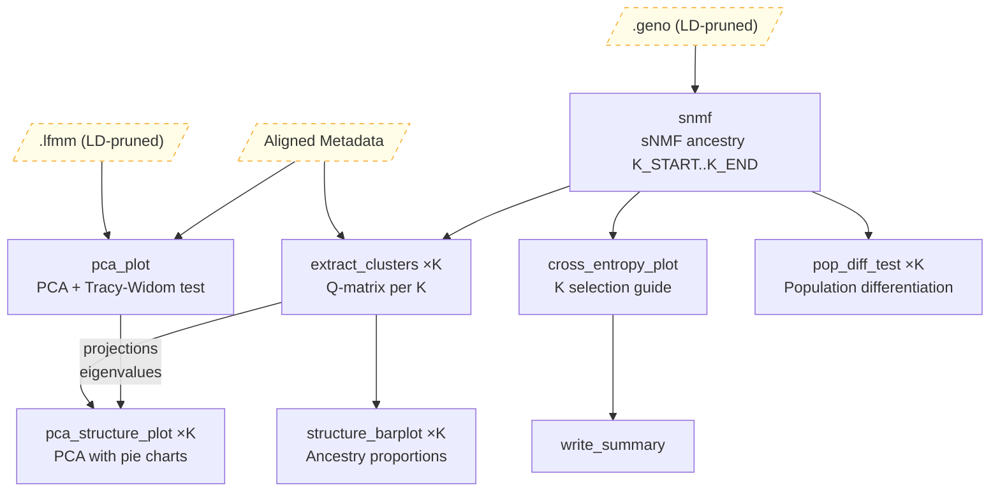
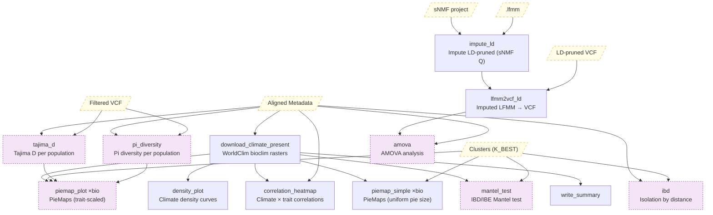
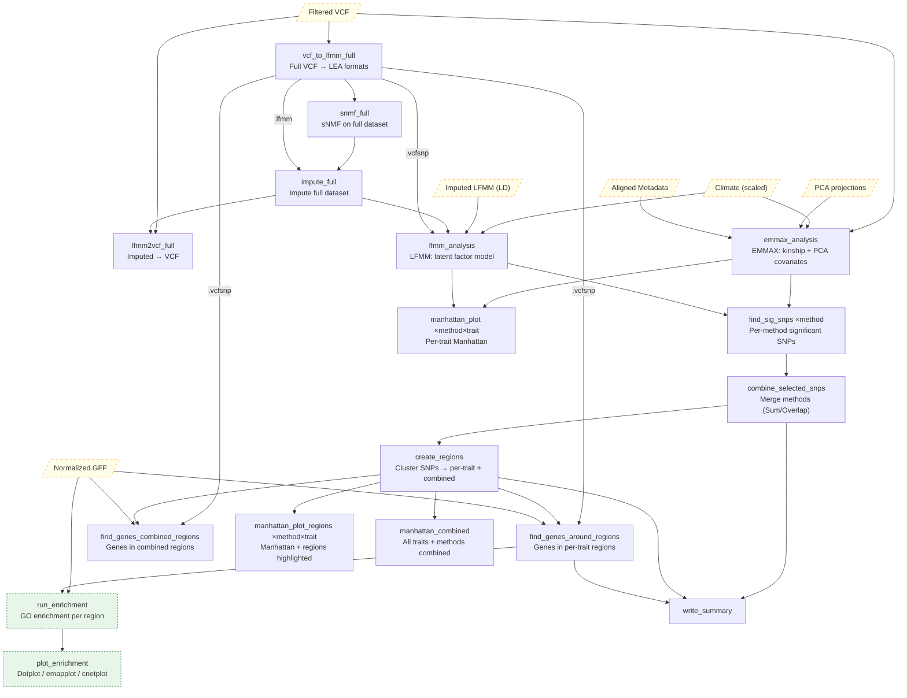
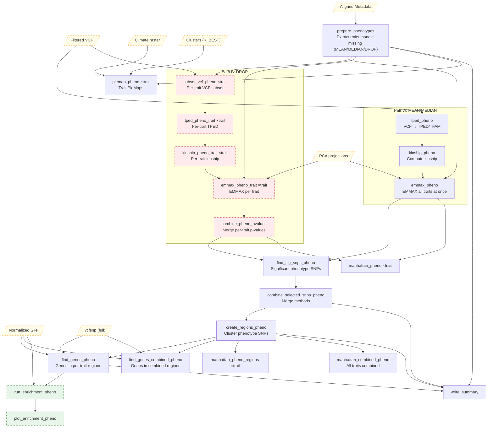
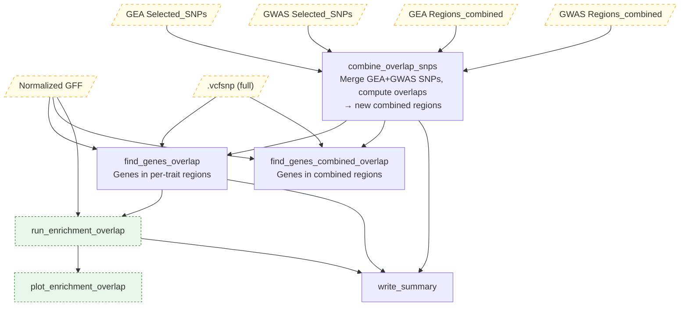
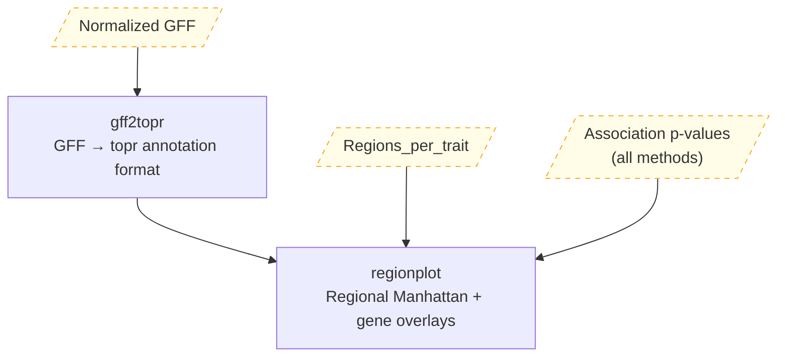
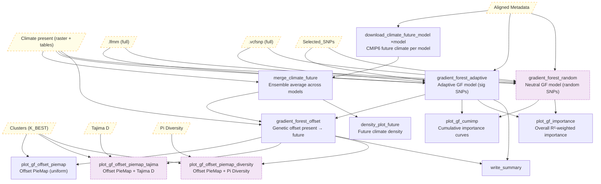

# ADAPTOGENE

A Dockerized pipeline for population genomics: structure, association, and maladaptation.

---

## Overview

**ADAPTOGENE** automates population genomic analyses from filtered VCF to candidate genes and conservation-relevant predictions. It integrates three analytical layers: (1) population structure inference via PCA and sNMF, (2) genotype–environment (GEA) and genotype–phenotype (GWAS) association mapping with region clustering, gene annotation, and GO enrichment, and (3) maladaptation assessment via Gradient Forest genetic offset modeling under future climate scenarios. All dependencies ship in a single Docker image; climate data is downloaded automatically.

---

## Key Features

- Unified framework for **population structure, association, and maladaptation**
- Automated **climate data download** (WorldClim bioclimatic variables, CMIP6 projections)
- **EMMAX + LFMM** association methods with configurable combination strategies
- **Region clustering → gene annotation → GO enrichment** pipeline with per-region visualizations
- Detection of **overlapping GEA/GWAS signals** across traits and methods
- **Interactive Shiny dashboard** for exploring all results
- **Pipeline summary table** accumulated across all modes
- Fully reproducible via **Docker + Snakemake**

---

## Requirements and Installation

Requires **Docker** and a Unix-like OS (Linux/macOS). All software dependencies are inside the Docker image.

```bash
git clone https://github.com/hubner-lab/ADAPTOGENE.git
cd ADAPTOGENE
docker build -t adaptogene .
```

---

## Input Data

| File | Format | Required | Description |
|------|--------|----------|-------------|
| Genotypes | `.vcf` / `.vcf.gz` | Yes | Biallelic SNP data |
| Metadata | TSV | Yes | Columns: `site`, `sample`, `latitude`, `longitude` [, trait columns...] |
| Annotation | GFF3 | For association | Gene models; include GO terms in attributes for enrichment |

Chromosome names are normalized automatically during processing (`chr1` → `1`). All outputs use stripped names.

---

## Quick Start

```bash
# Run processing mode
docker run --user $(id -u):$(id -g) --rm --memory=20g -v $PWD:/pipeline adaptogene:latest \
  snakemake -c4 -s Snakefile --config mode=processing --configfile config.yaml --scheduler greedy
```

Replace `mode=processing` with subsequent modes from the table below. Use `-n` for dry runs, `-R <rule>` to force a rule and its downstream, `-p` to print shell commands.

For interactive development:

```bash
docker run -w /pipeline --user $(id -u):$(id -g) -it -v $PWD:/pipeline adaptogene bash
snakemake -s Snakefile --configfile config.yaml --config mode=<MODE> --cores 4 --scheduler greedy
```

---

## Pipeline Modes

Run modes sequentially. Each mode is invoked via `--config mode=<MODE>`.

| # | Mode | Purpose | Key Config | Main Outputs |
|---|------|---------|------------|--------------|
| 1 | `processing` | Filter VCF, LD prune, normalize | `FILTER_*`, `LD_*` | Filtered VCF, LEA formats |
| 2 | `structure` | PCA, sNMF ancestry (K range) | `SNMF_K_START/END` | PCA plots, cross-entropy, Q-matrices |
| 3 | `structure_K` | Impute, climate download, piemaps | `SNMF_K_BEST`, `MAP_*` | Piemaps, climate tables, pop stats |
| 4 | `association` | GEA: EMMAX/LFMM → regions → genes → GO | `ASSOC_*`, `ENRICHMENT_*` | Manhattan plots, regions, genes, enrichment |
| 5 | `association_phenotypes` | GWAS on metadata traits (cols 5+) | `PHENO_*` | Manhattan, piemaps, regions, genes |
| 6 | `overlapping` | GEA ∩ GWAS overlap analysis | `OVERLAP_*` | Miami plot, overlap stats, combined regions |
| 7 | `regionplot` | Regional Manhattan + gene annotations | `REGIONPLOT_*` | Publication-ready region figures |
| 8 | `maladaptation` | Gradient Forest → genetic offset | `GF_*`, `FUTURE_*` | Offset maps, importance plots, site scores |
| 9 | `haplotype_scan` | crosshap epsilon scanning | `HAPLOTYPE_SCAN_*` | HapObjects, clustree plots |
| 10 | `haplotype` | Haplotype viz at selected epsilon | `HAPLOTYPE_EPSILON_SELECTED` | crosshap_viz, boxplots, piemaps |

> **After mode 2**: inspect the cross-entropy plot and set `SNMF_K_BEST` in `config.yaml` before continuing.
> **After mode 9**: inspect clustree plots and set `HAPLOTYPE_EPSILON_SELECTED` before running mode 10.

### Pipeline Flow



### Detailed Rule DAGs

<details>
<summary><b>Processing Mode</b> — VCF filtering, LD pruning, format conversion</summary>


</details>

<details>
<summary><b>Structure Mode</b> — Population structure inference</summary>


</details>

<details>
<summary><b>Structure K Mode</b> — Imputation, climate, population statistics</summary>



Purple nodes = optional, require `POP_CALC_STATS: TRUE`.
</details>

<details>
<summary><b>Association Mode (GEA)</b> — Climate association analysis</summary>


</details>

<details>
<summary><b>Phenotype Association Mode</b> — GWAS on phenotypic traits</summary>



Red nodes = DROP path only (per-trait subsetting). Either Path A or Path B runs, not both.
</details>

<details>
<summary><b>Overlapping Mode</b> — GEA + GWAS combined</summary>


</details>

<details>
<summary><b>Regionplot Mode</b> — Regional Manhattan with gene annotations</summary>


</details>

<details>
<summary><b>Maladaptation Mode</b> — Gradient Forest and genetic offset</summary>



Purple nodes = optional (random model requires `GF_RANDOM_MODEL: TRUE`; Tajima/Pi piemaps require `POP_CALC_STATS: TRUE`).
</details>

---

## Configuration

All parameters are defined in `config.yaml`. See the **[Configuration Reference](docs/configuration.md)** for full parameter documentation, YAML examples, GO enrichment details, and output directory structure.

---

## Interactive Results Viewer

ADAPTOGENE includes a Shiny dashboard that auto-discovers all projects and organizes outputs into tabs: Structure, Structure K, Association, Phenotype Association, Overlapping Regions, Maladaptation. Interactive Manhattan plots support click-to-select-region with linked gene and GO enrichment tables.

```bash
docker run --user $(id -u):$(id -g) --rm -p 3838:3838 -v $PWD:/pipeline adaptogene:latest \
  Rscript -e "shiny::runApp('/pipeline/scripts/app.R', host='0.0.0.0', port=3838)"
```

Open http://localhost:3838 in your browser.

---

## Citation

If you use ADAPTOGENE in published work, please cite:

- This repository: `https://github.com/hubner-lab/ADAPTOGENE`
- Underlying methods:
  - **sNMF**: Frichot et al. 2014, *Molecular Biology and Evolution*
  - **EMMAX**: Kang et al. 2010, *Nature Genetics*
  - **LFMM**: Frichot et al. 2013, *Molecular Biology and Evolution*
  - **Gradient Forest**: Ellis et al. 2012, *Ecology*
  - **WorldClim**: Fick & Hijmans 2017, *International Journal of Climatology*
  - **clusterProfiler**: Yu et al. 2012, *OMICS*

---

## License

This pipeline is open-source software. See LICENSE file for details.

