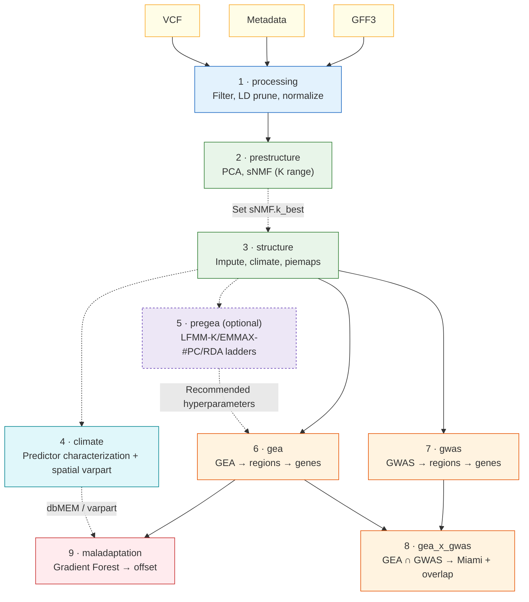
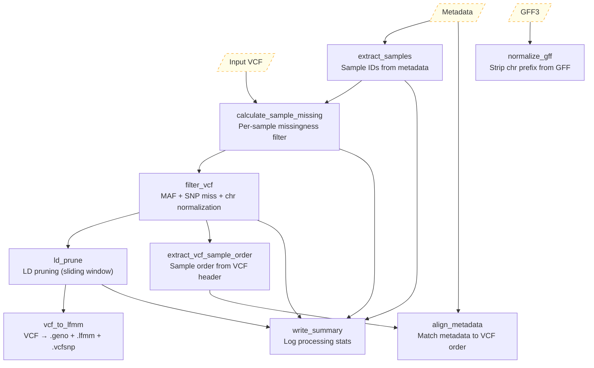
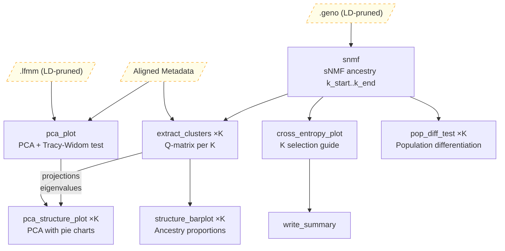
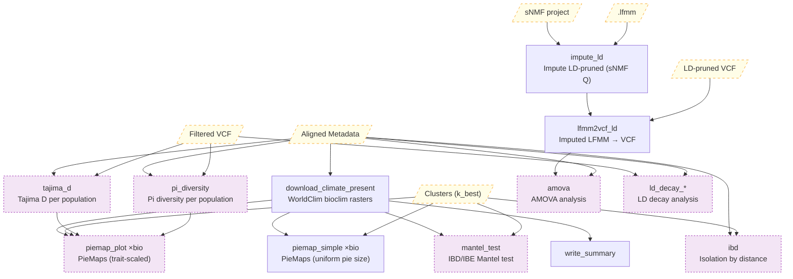
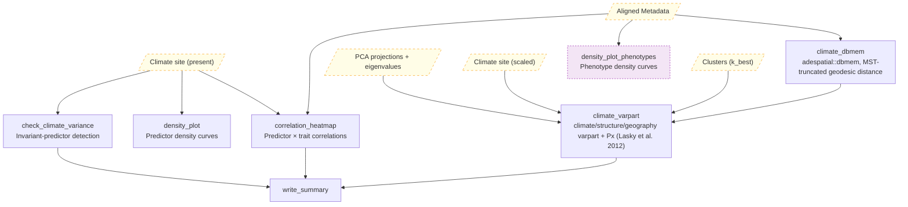
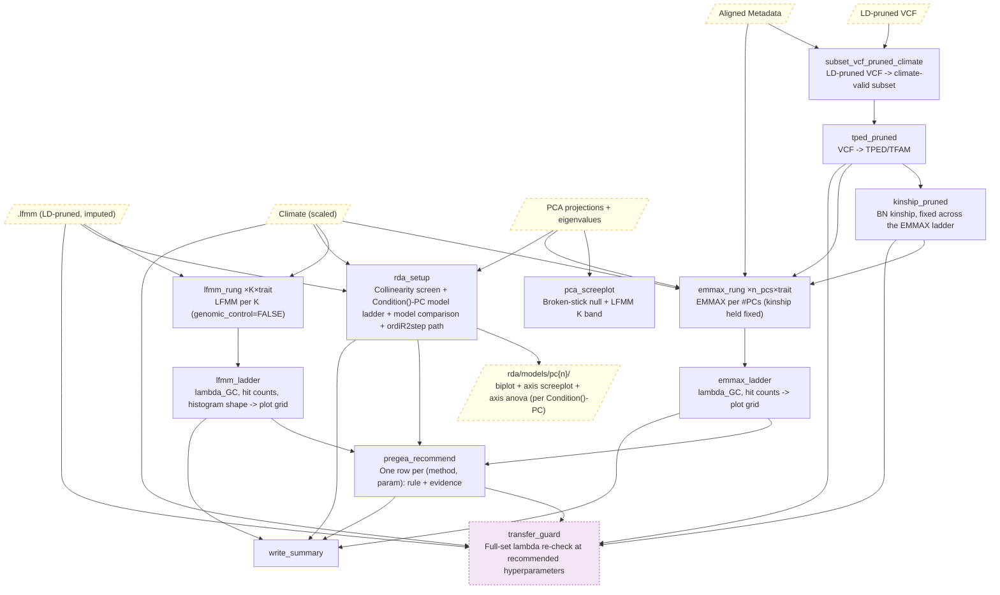
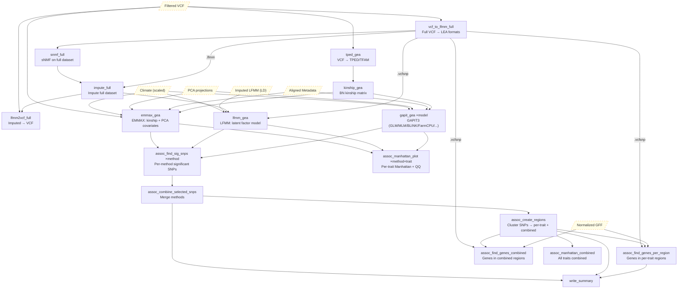
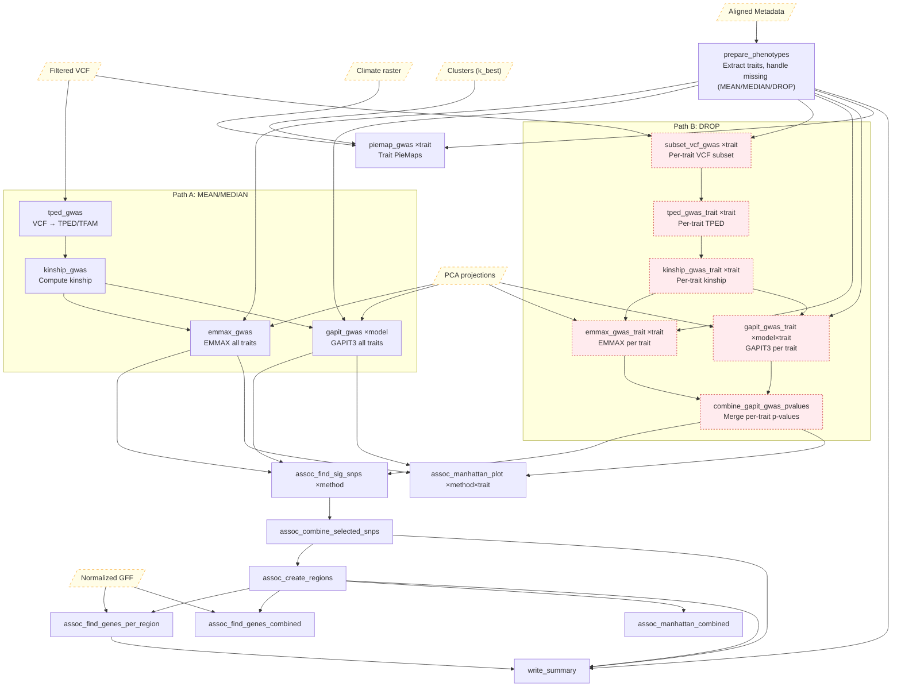
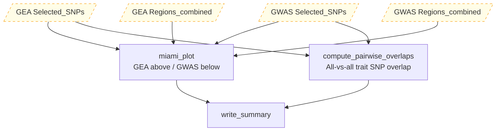
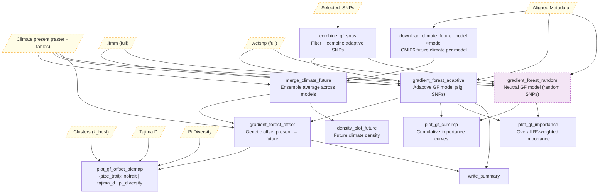

# ADAPTOGENE

A Dockerized pipeline for population genomics: structure, association, and maladaptation.

---

## Overview

**ADAPTOGENE** automates population genomic analyses from filtered VCF to candidate genes and conservation-relevant predictions. It integrates three analytical layers: (1) population structure inference via PCA and sNMF, (2) genotype–environment (GEA) and genotype–phenotype (GWAS) association mapping with region clustering, gene annotation, and GO enrichment, and (3) maladaptation assessment via Gradient Forest genetic offset modeling under future climate scenarios. All dependencies ship in a single Docker image; climate data is downloaded automatically.

---

## Key Features

- Unified framework for **population structure, association, and maladaptation**
- Automated **climate data download** (WorldClim bioclimatic variables, CMIP6 projections)
- **EMMAX + LFMM + GAPIT3** (8 models) association methods with configurable combination strategies
- **Region clustering → gene annotation → GO enrichment** with on-demand interactive visualization
- Detection of **overlapping GEA/GWAS signals** across traits and methods
- **Interactive Shiny dashboard** for exploring all results (region-centric, on-demand enrichment/regionplot/haplotype)
- **Pipeline summary table** accumulated across all modes
- Fully reproducible via **Docker + Snakemake**

---

## Requirements and Installation

Requires **Docker** and a Unix-like OS (Linux/macOS). All software dependencies are inside the Docker image.

```bash
git clone https://github.com/hubner-lab/ADAPTOGENE.git
cd ADAPTOGENE
docker build -t adaptogene .
```

---

## Input Data

| File | Format | Required | Description |
|------|--------|----------|-------------|
| Genotypes | `.vcf` / `.vcf.gz` | Yes | Biallelic SNP data |
| Metadata | TSV | Yes | Columns: `site`, `sample`, `latitude`, `longitude` [, trait columns...] |
| Annotation | GFF3 | For association | Gene models; include GO terms in attributes for enrichment |

Chromosome names are normalized automatically during processing (`chr1` → `1`). All outputs use stripped names.

---

## Quick Start

```bash
# Run processing mode
docker run --user $(id -u):$(id -g) --rm --memory=20g -v $PWD:/pipeline adaptogene:latest \
  snakemake -c4 -s Snakefile --config mode=processing --configfile config.yaml --scheduler greedy
```

Replace `mode=processing` with subsequent modes from the table below. Use `-n` for dry runs, `-R <rule>` to force a rule and its downstream, `-p` to print shell commands.

For interactive development:

```bash
docker run -w /pipeline --user $(id -u):$(id -g) -it -v $PWD:/pipeline adaptogene bash
snakemake -s Snakefile --configfile config.yaml --config mode=<MODE> --cores 4 --scheduler greedy
```

---

## Pipeline Modes

Run modes sequentially. Each mode is invoked via `--config mode=<MODE>`.

| # | Mode | Purpose | Key Config | Main Outputs |
|---|------|---------|------------|--------------|
| 1 | `processing` | Filter VCF, LD prune, normalize | `Filter.*`, `LD.*` | Filtered VCF, LEA formats |
| 2 | `prestructure` | PCA, sNMF ancestry (K range) | `sNMF.k_start`, `sNMF.k_end` | PCA plots, cross-entropy, Q-matrices |
| 3 | `structure` | Impute, climate download, piemaps | `sNMF.k_best`, `Map.*` | Piemaps, climate tables, pop stats, LD decay |
| 4 | `climate` | Predictor characterization: correlation/density, invariant-predictor detection, dbMEM + variance partitioning | `Climate.*`, `Climate.Varpart.*`, `Climate.dbMEM.*` | Correlation heatmap, density plots, dbMEM eigenvectors, varpart fractions |
| 5 | `pregea` | Hyperparameter exploration (LD-pruned): LFMM-K / EMMAX-#PC / RDA-Condition()-PC ladders (one shared PC range) | `PreGEA.*` | Ladder grids, RDA per-model artifacts, one recommendation per (method, param) |
| 6 | `gea` | GEA: EMMAX/LFMM/GAPIT → regions → genes | `GEA.*`, `GFF.*`, `Enrichment.*` | Manhattan plots, regions, genes |
| 7 | `gwas` | GWAS on metadata traits (cols 5+) | `GWAS.*` | Manhattan, piemaps, regions, genes |
| 8 | `gea_x_gwas` | GEA + GWAS overlap analysis | `GEAxGWAS.*` | Miami plot, pairwise overlap tables |
| 9 | `maladaptation` | Gradient Forest → genetic offset | `Maladaptation.*`, `Future.*` | Offset maps, importance plots, site scores |

> **After mode 2**: inspect the cross-entropy plot and set `sNMF.k_best` in `config.yaml` before continuing.

> **Mode 4 (`climate`)** characterizes the environmental predictors (correlation/density curves, invariant-predictor detection) and computes the shared spatial artifacts — dbMEM eigenvectors and climate/structure/geography variance partitioning — reused by both `pregea` and the spatial Gradient Forest.

> **Mode 5 (`pregea`) is optional but recommended** before mode 6: it sweeps LFMM-K, EMMAX-#PC, and RDA Condition()-PC (one shared PC range) on the cheap LD-pruned dataset and writes one recommended value per (method, hyperparameter), surfaced with pre-fill/Apply badges in the GEA tab's method editor — read it before committing to the expensive full-SNP `gea` run.

> **Run `mode=climate` before requesting a spatial (or `both`) Gradient Forest** in `mode=maladaptation`: the GF spatial variant reads `climate/tables/{spatial,varpart}/` (dbMEM vectors + forward-selection mask). This ordering is no longer enforced by a config-time guard — a missing `climate` run surfaces only as a Snakemake missing-input error.

> **Regionplot, GO enrichment, haplotype scanning, and haplotype visualization** are computed on-demand in the Shiny dashboard rather than as pipeline modes.

### Fixed constants (PreGEA / Climate)

The preGEA/climate split slimmed `PreGEA.*` from ~30 fields to ~10. The following values are now fixed in code (`workflow/rules/common.smk`) rather than exposed as config keys:

| Constant | Value | Why |
|----------|-------|-----|
| PreGEA random seed | `42` | Reproducible ladders; no longer a `PreGEA.seed` key |
| EMMAX/GAPIT kinship | `BN` | EMMAX and GAPIT share the one BN matrix from `emmax-kin`; the old `EMMAX.kinship` IBS alternative was never exercised |
| PreGEA LFMM `genomic_control` | `FALSE` | Keeps λ_GC informative for K selection (GC forces λ≈1). The production run has its own switch, `GEA.configs[LFMM].params.genomic_control`, default `TRUE` |
| LFMM/EMMAX hit-count FDR | `0.1` | Hit-count vs K/#PC is a trend read, not a threshold decision. Bonferroni is still computed into the ladder TSV but no longer plotted |
| EMMAX minimum #PCs | `0` | `n_pcs=0` is the kinship-only reference panel at the bottom of the #PC ladder |
| RDA minimum predictors | `2` | RDA cannot fit with fewer than 2 predictors — a hard requirement, not a preference |
| Recommender λ tolerance | `0.15` | Width of the recommender's λ calibration band; the user reads the actual λ plot to decide |
| Recommender deflation floor | `0.90` | Lower λ bound the recommender flags as over-correction |
| `ordiR2step` `Pin` / `R2permutations` | `0.01` / `999` | Blanchet double-stopping-rule standard for forward selection (Climate varpart + RDA setup) |

Removed switches and consolidations (no longer config keys anywhere): LFMM/EMMAX/RDA have no per-block `enabled` switches — they always run together in one `mode=pregea` pass; `Varpart` likewise has no switch (it moved into `mode=climate` and runs unconditionally). `LFMM.k_offset_low`/`k_offset_high`/`k_min` consolidated into a single `PreGEA.k_offset` (sweep = `sNMF.k_best ± k_offset`); `RDA.condition_pcs_min`/`condition_pcs_max` consolidated into the shared `PreGEA.n_pcs_max` (EMMAX #PCs and RDA Condition()-PCs now sweep the identical `0..n_pcs_max` range). `LFMM.fdr`/`bonf_alpha`, `EMMAX.fdr`/`bonf_alpha`, `EMMAX.lambda_tol`/`deflation_floor`, and `EMMAX.n_pcs_min` are dropped per the fixed values above.

### Pipeline Flow



### Detailed Rule DAGs

<details>
<summary><b>Processing Mode</b> — VCF filtering, LD pruning, format conversion</summary>


</details>

<details>
<summary><b>PreStructure Mode</b> — Population structure inference</summary>



**Key outputs**:
- `PreStructure/plots/pca.png/svg`, `tracy_widom.png/svg`
- `PreStructure/plots/cross_entropy_K{start}-{end}.png/svg`
- `PreStructure/plots/K{k}/structure_K{k}.png/svg`
- `PreStructure/tables/K{k}/clusters_K{k}.tsv`
</details>

<details>
<summary><b>Structure Mode</b> — Imputation, climate, population statistics</summary>



Purple nodes = optional (`Population.calc_stats: true`).

**Key outputs**:
- `climate/rasters/present/`, `climate/tables/present/climate_present_{all,site,site_scaled}.tsv` (predictor characterization tables are produced by `mode=climate`)
- `Structure/plots/piemap/piemap_{bio}.png/svg` + `zoom/`
- `Structure/tables/pop_stats/tajima_d_by_pop.tsv`, `pi_diversity_by_pop.tsv`
- `Structure/plots/ld_decay/ld_decay_genome_wide.png/svg`
</details>

<details>
<summary><b>Climate Mode</b> — Predictor characterization and shared spatial artifacts</summary>



Purple node = optional (`density_plot_phenotypes` needs trait columns in the metadata). The dbMEM + varpart artifacts are the shared spatial products reused by the spatial Gradient Forest (`mode=maladaptation`).

**Key outputs**:
- `climate/plots/correlation_heatmap.png`, `density_plot_present.png`, `density_plot_phenotypes.png`
- `climate/tables/present/climate_invariant_predictors.tsv`
- `climate/tables/spatial/dbmem_vectors.tsv`, `dbmem_diagnostics.tsv` + `climate/plots/spatial/dbmem_screeplot.png/svg`
- `climate/tables/varpart/varpart_fractions.tsv`, `varpart_anova.tsv`, `px_per_variable.tsv`, `dbmem_selected.tsv`
- `climate/plots/varpart/varpart_venn.png`, `varpart_fractions_bar.png`, `px_barplot.png`, `dbmem_selection_path.png`
</details>

<details>
<summary><b>PreGEA Mode</b> (optional) — LD-pruned hyperparameter exploration before the full GEA run</summary>



Purple node = opt-in (`PreGEA.TransferGuard.enabled: true`) — the one PreGEA rule that pulls the full-set imputation chain into this otherwise LD-pruned-only mode. `lambda_GC` is deliberately fit with `genomic_control=FALSE` for the LFMM ladder — with it on, `lfmm2.test`'s recalibration forces lambda toward 1 regardless of whether K is correct, so K selection uses p-value-histogram flatness instead.

**Key outputs**:
- `PreGEA/tables/{lfmm,emmax}/{lfmm,emmax}_ladder.tsv` + `PreGEA/plots/{lfmm,emmax}/*_histogram_grid.png`, `*_qq_grid.png`, `*_lambda_vs_*.png`, `*_hits_vs_*.png`
- `PreGEA/tables/rda/rda_condition_ladder.tsv`, `rda_predictor_collinearity.tsv`, `rda_ordir2step_path.tsv` + `PreGEA/plots/rda/rda_model_comparison.png`, `rda_ordir2step_path.png`
- `PreGEA/plots/rda/models/pc{n}/biplot.png/svg`, `axis_screeplot.png/svg` + `PreGEA/tables/rda/models/pc{n}/axis_anova.tsv` — one set per Condition()-PC value, selectable in the Shiny RDA tab
- `PreGEA/tables/pregea_recommendations.tsv` — read by the GEA tab's method editor for pre-fill/Apply badges
- `PreGEA/tables/pregea_transfer_guard.tsv` (opt-in only)
</details>

<details>
<summary><b>GEA Mode</b> — Climate association analysis</summary>



**Key outputs**:
- `GEA/GAPIT_native_output/{model}/`
- `GEA/tables/methods/{method}/` — per-method p-values + significant SNPs
- `GEA/tables/selected_snps.tsv`, `regions_per_trait.tsv`, `regions_combined.tsv`
- `GEA/tables/genes_per_region.tsv`, `genes_combined.tsv`
- `GEA/plots/manhattan/{method}/manhattan_{trait}_K{k}_{adjust}.png/svg`
- `GEA/plots/manhattan/combined/manhattan_combined_K{k}.png/svg`
</details>

<details>
<summary><b>GWAS Mode</b> — Association on phenotypic traits</summary>



Red nodes = DROP path only.

**Key outputs** (same structure as GEA but under `GWAS/`):
- `GWAS/tables/selected_snps.tsv`, `regions_per_trait.tsv`, `regions_combined.tsv`
- `GWAS/plots/manhattan/{method}/`, `GWAS/plots/manhattan/combined/`
- `GWAS/plots/piemap/phenomap_{trait}.png/svg` + `zoom/`
</details>

<details>
<summary><b>GEAxGWAS Mode</b> — GEA + GWAS overlap analysis</summary>



Region overlap detection, gene annotation, and GO enrichment are computed on-demand in the Shiny dashboard.

**Key outputs**:
- `GEAxGWAS/plots/miami_combined_K{k}.png/svg` + `_background.png` + `_coords.json`
- `GEAxGWAS/tables/pairwise_collapsed_snps.tsv`, `pairwise_overlap_table.tsv`
</details>

<details>
<summary><b>Maladaptation Mode</b> — Gradient Forest and genetic offset</summary>



Purple nodes = optional (`Maladaptation.methods.gradient_forest.random_model: true`; `Population.calc_stats: true` for Tajima/Pi piemaps).

**Key outputs** (under `Maladaptation/{plots,tables}/gradient_forest/{run_label}_{spatial_tag}/`):
- `Maladaptation/plots/gradient_forest/{suffix}/cumulative_importance.png/svg`
- `Maladaptation/plots/gradient_forest/{suffix}/overall_importance.png/svg`
- `Maladaptation/plots/gradient_forest/{suffix}/genetic_offset_piemap[_{tajima_d,pi_diversity}].png/svg`
- `Maladaptation/tables/gradient_forest/{suffix}/genetic_offset_{map,site}.tsv`
</details>

---

## Configuration

All parameters are defined in `config.yaml`. See the **[Configuration Reference](docs/configuration.md)** for full parameter documentation, YAML examples, and output directory structure.

---

## Interactive Results Viewer

ADAPTOGENE includes a Shiny dashboard that auto-discovers all projects and organizes outputs into tabs: **Home**, **Processing**, **PreStructure**, **Structure**, **GEA**, **GWAS**, **GEAxGWAS**, **Maladaptation**.

The interface is **region-centric**: clicking a significant SNP in any Manhattan plot selects a genomic region and reveals a consolidated detail panel with GO enrichment plots, gene annotations, enrichment tables, regionplot, and haplotype analysis — all computed on-demand, directly below the Manhattan. Results persist to disk across sessions.

```bash
docker run --user $(id -u):$(id -g) --rm -p 3838:3838 -v $PWD:/pipeline adaptogene:latest \
  R -e "adaptogene.app::run_app(options = list(host = '0.0.0.0', port = 3838))"
```

Open http://localhost:3838 in your browser.

---

## Validation and Benchmarking

ADAPTOGENE is validated on two complementary categories of datasets:

**Empirical benchmarks** (known ground-truth loci, real organisms):
- [Benchmark Datasets](benchmarks/README.md) — Arabidopsis 1001G, Populus balsamifera, Rice RDP1, Sorghum SAP. Download and preparation scripts in `benchmarks/`.
- [Benchmark Testing Plan](benchmarks/TESTING_PLAN.md) — step-by-step execution sequence for all modes.

**Simulation benchmarks** (full ground truth: causal loci + fitness):
- [Simulation Benchmark Guide](docs/laruson_benchmark.md) — end-to-end validation on Láruson et al. 2022 (SLiM simulations, Dryad DOI: 10.5061/dryad.x95x69pkk). Tests both offset-vs-fitness correlation and causal-SNP detection rates.
- [Headless Automation Roadmap](docs/laruson_automation_roadmap.md) — specification for running the full benchmark without the Shiny GUI, including the custom-environment source, headless SNP-set promotion, run-all driver, and two-axis evaluation harness.

---

## Citation

If you use ADAPTOGENE in published work, please cite:

- This repository: `https://github.com/hubner-lab/ADAPTOGENE`
- Underlying methods:
  - **sNMF**: Frichot et al. 2014, *Molecular Biology and Evolution*
  - **EMMAX**: Kang et al. 2010, *Nature Genetics*
  - **LFMM**: Frichot et al. 2013, *Molecular Biology and Evolution*
  - **GAPIT3**: Wang & Zhang 2021, *Genomics, Proteomics & Bioinformatics*
  - **Gradient Forest**: Ellis et al. 2012, *Ecology*
  - **WorldClim**: Fick & Hijmans 2017, *International Journal of Climatology*
  - **clusterProfiler**: Yu et al. 2012, *OMICS*

---

## License

This pipeline is open-source software. See LICENSE file for details.
