# ADAPTOGENE Pipeline DAGs

## Overview

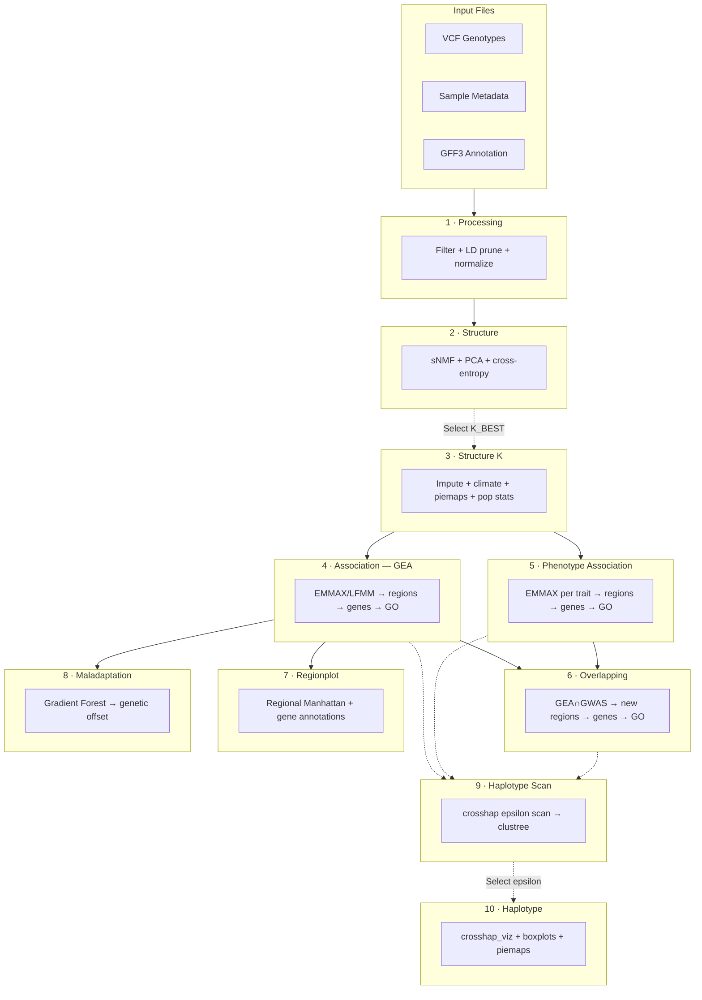

Each mode is run separately via `--config mode=<MODE>`.

---

## Detailed Rule DAGs

Node labels match Snakefile rule names exactly. `×N` indicates wildcard-expanded rules.

### Processing Mode — VCF filtering, LD pruning, format conversion

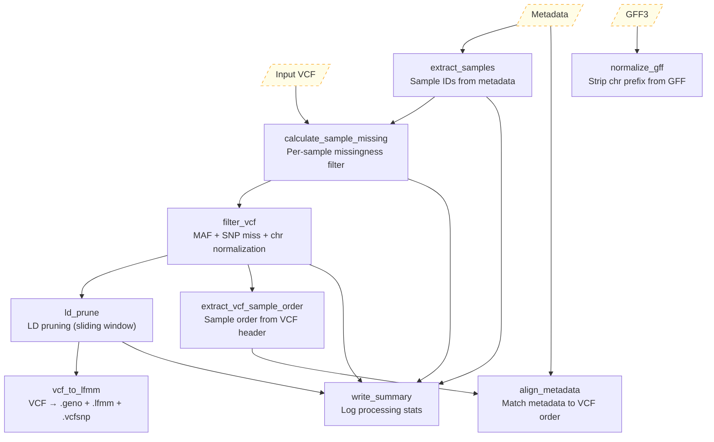

**Key outputs**:
- `_work/.../filtered.vcf`, `_work/.../ld.../pruned.vcf` — filtered + LD-pruned VCFs
- `_work/.../ld.../{name}.geno`, `.lfmm`, `.vcfsnp` — LEA format conversions
- `processing/tables/metadata.tsv` — aligned metadata (sample order matches VCF)
- `processing/tables/sample_missing_stats.tsv` — per-sample missingness
- `_intermediate/annotation/normalized.gff3` — chr-stripped GFF

---

### Structure Mode — Population structure inference

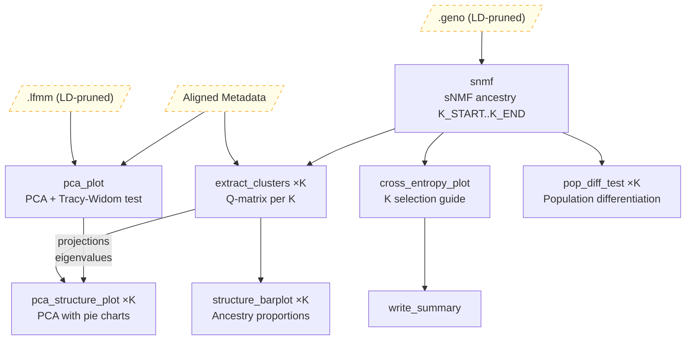

**Key outputs**:
- `structure/plots/pca.png/svg`, `tracy_widom.png/svg` — PCA scatter + eigenvalue test
- `structure/plots/cross_entropy_K{start}-{end}.png/svg` — K selection guide
- `structure/plots/structure_K{k}.png/svg` — ancestry barplots (per K)
- `structure/plots/pca_structure_K{k}.png/svg` — PCA with ancestry pies
- `structure/plots/pop_diff_K{k}.png/svg` — population differentiation
- `structure/tables/clusters_K{k}.tsv` — Q-matrices per K

---

### Structure K Mode — Imputation, climate, population statistics

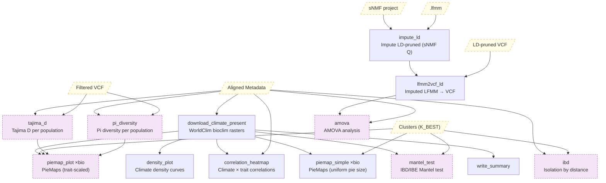

**Purple nodes** = optional, require `pop.calc_stats: TRUE`

**Key outputs**:
- `climate/rasters/present/climate_present_rasterstack.grd` — WorldClim bioclim rasters
- `climate/tables/present/climate_present_{all,site,site_scaled}.tsv`
- `climate/plots/density_plot_present.png/svg`, `correlation_heatmap.png/svg`
- `structure_k/plots/piemap/piemap_{bio}.png/svg/qs` + `zoom/` variants
- `structure_k/plots/piemap/{tajima_d,pi_diversity}/piemap_{bio}_{metric}.png/svg/qs` (optional)
- `structure_k/tables/pop_stats/tajima_d_by_pop.tsv`, `pi_diversity_by_pop.tsv`, `ibd_raw.tsv`, `ibd_pairs.tsv`, `amova.tsv`
- `structure_k/plots/pop_stats/mantel_test.png/svg`, `amova.png/svg`

---

### Association Mode (GEA) — Climate association analysis

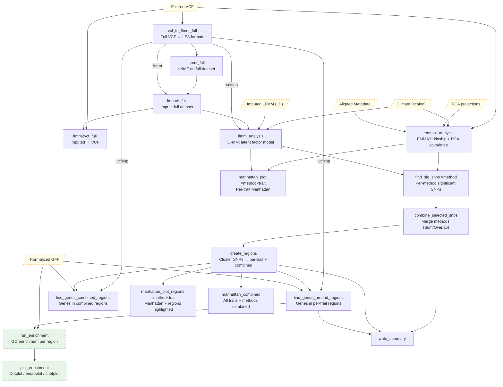

**Key outputs**:
- `association/tables/{METHOD}/{method}_pvalues_K{k}.tsv` — per-method p-values
- `association/tables/{METHOD}/{method}_pvalues_K{k}_sig_snps_{adjust}.tsv` — significant SNPs
- `association/tables/selected_snps.tsv` — merged across methods
- `association/tables/regions_per_trait.tsv`, `regions_combined.tsv` — clustered regions
- `association/tables/genes_per_region.tsv`, `genes_per_region_collapsed.tsv`, `genes_combined.tsv`
- `association/plots/manhattan/{METHOD}/manhattan_{trait}_K{k}_{adjust}.png/svg` (plain + regions)
- `association/plots/manhattan_combined_K{k}.png/svg`
- `association/plots/enrichment/{trait}/region_{id}_dotplot.png/svg` (+ emapplot, cnetplot)
- `association/tables/enrichment/{trait}/region_{id}_enrichment.tsv`

---

### Phenotype Association Mode — GWAS on phenotypic traits

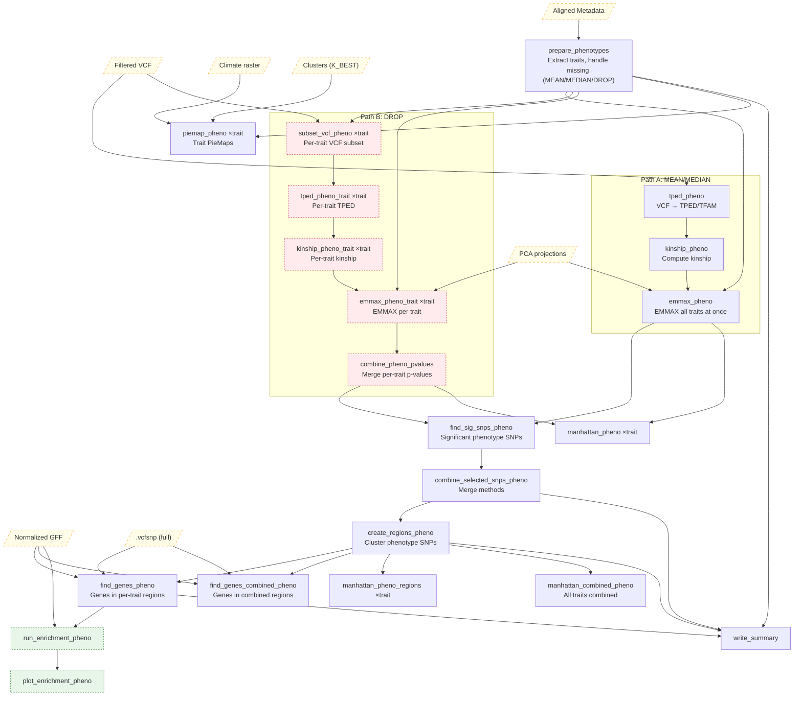

**Red nodes** = DROP path only (per-trait subsetting). Either Path A or Path B runs, not both.

**Key outputs**: Same structure as association/ but under `phenotype_association/`. Additionally:
- `phenotype_association/tables/phenotype_missing_summary.tsv`
- `phenotype_association/plots/piemap/phenomap_{trait}.png/svg/qs` + `zoom/`

---

### Overlapping Mode — GEA + GWAS combined

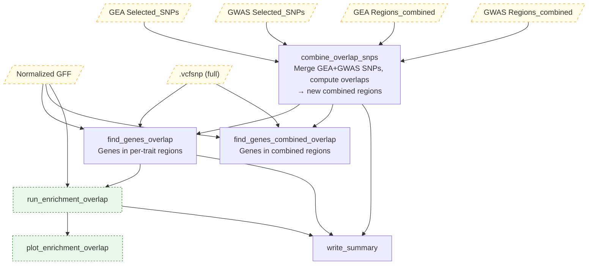

**Key outputs**:
- `overlapping/tables/selected_snps_all.tsv` — merged GEA+GWAS SNPs
- `overlapping/tables/regions_per_trait_all.tsv`, `regions_combined.tsv`
- `overlapping/tables/overlap_summary.tsv` — overlap statistics
- `overlapping/tables/genes_per_region.tsv`, `genes_per_region_collapsed.tsv`, `genes_combined.tsv`
- `overlapping/plots/enrichment/{trait}/region_{id}_dotplot.png/svg`

---

### Regionplot Mode — Regional Manhattan with gene annotations

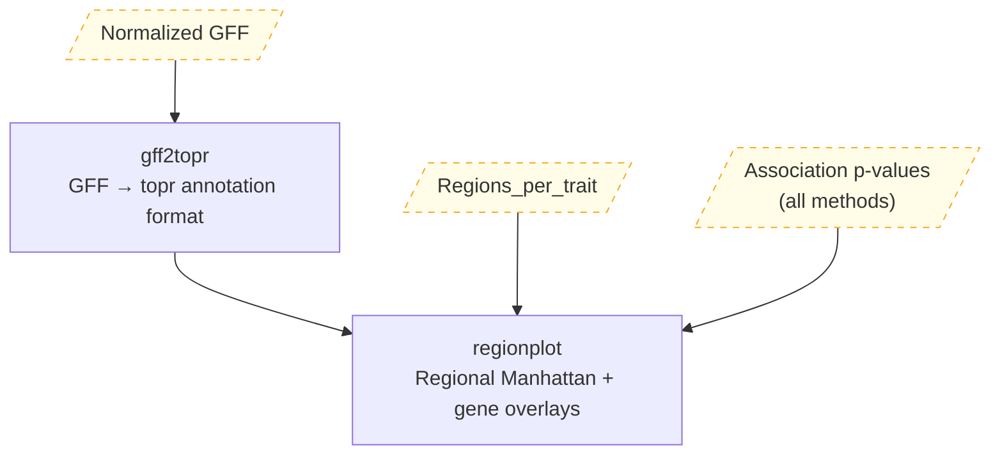

**Key outputs**:
- `regionplot/plots/regionplot_{region}_{trait}.png` + `_main.svg`, `_overview.svg`, `_genes.svg`

---

### Maladaptation Mode — Gradient Forest and genetic offset

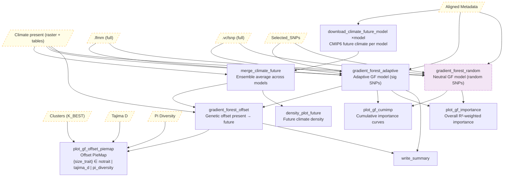

**Purple nodes** = optional (random model requires `gradient_forest.random_model: TRUE`; `tajima_d`/`pi_diversity` piemaps require `pop.calc_stats: TRUE`)

**Key outputs** (under `Maladaptation/{plots,tables}/{method}/{run_label}_{spatial_tag}/`):
- `climate/tables/future/climate_future_year{Y}_ssp{S}_{site,all}.tsv`
- `climate/rasters/future/` — CMIP6 future rasters
- `climate/plots/density_plot_future_ssp{S}_{Y}.png/svg`
- `Maladaptation/plots/gradient_forest/{suffix}/cumulative_importance.png/svg`
- `Maladaptation/plots/gradient_forest/{suffix}/overall_importance.png/svg`
- `Maladaptation/plots/gradient_forest/{suffix}/genetic_offset_piemap[_{tajima_d,pi_diversity}].png/svg`
- `Maladaptation/tables/gradient_forest/{suffix}/genetic_offset_{map,site}.tsv`

---

### Haplotype Scan Mode — crosshap epsilon scanning

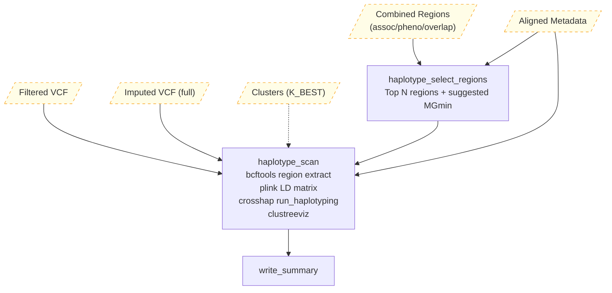

**Key outputs**:
- `haplotype_scan/{tag}/tables/selected_regions.tsv` — top regions for scanning
- `haplotype_scan/{tag}/tables/scan_status.tsv` — per-region scan status
- `haplotype_scan/{tag}/plots/clustree/region_{id}_clustree.png/svg`
- `_intermediate/haplotype/{tag}/region_{id}_hapobject.qs` — crosshap HapObjects

---

### Haplotype Mode — Visualization at selected epsilon

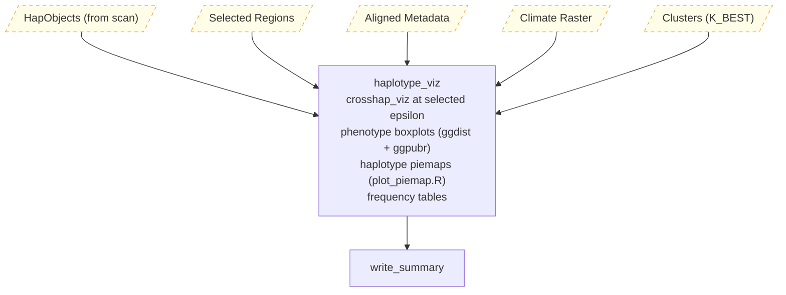

**Key outputs**:
- `haplotype/{tag}/plots/region_{id}_crosshap_viz.png/svg`
- `haplotype/{tag}/plots/region_{id}_boxplot_{trait}.png/svg`
- `haplotype/{tag}/plots/region_{id}_piemap_{trait}.png/svg/qs` + `zoom/`
- `haplotype/{tag}/tables/region_{id}_assignments.tsv`, `_frequencies.tsv`
