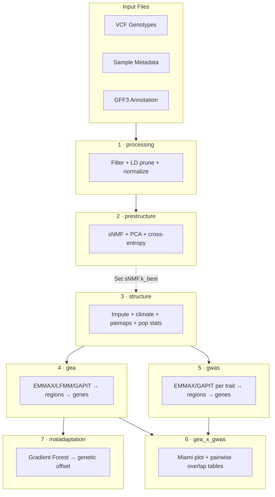
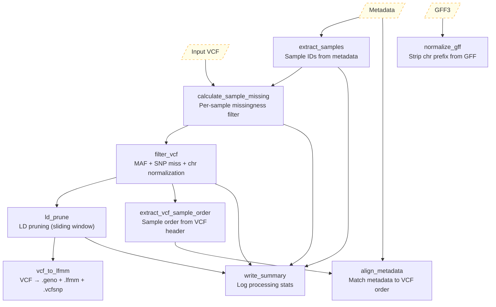
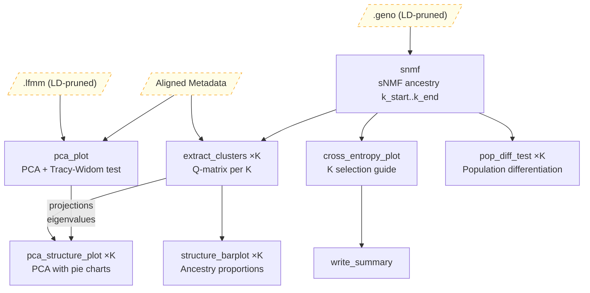
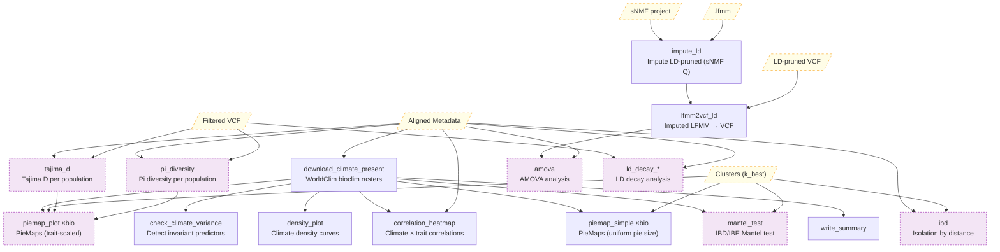
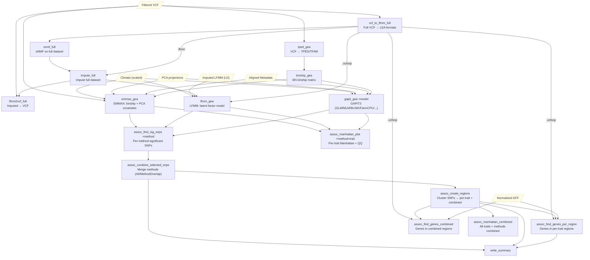
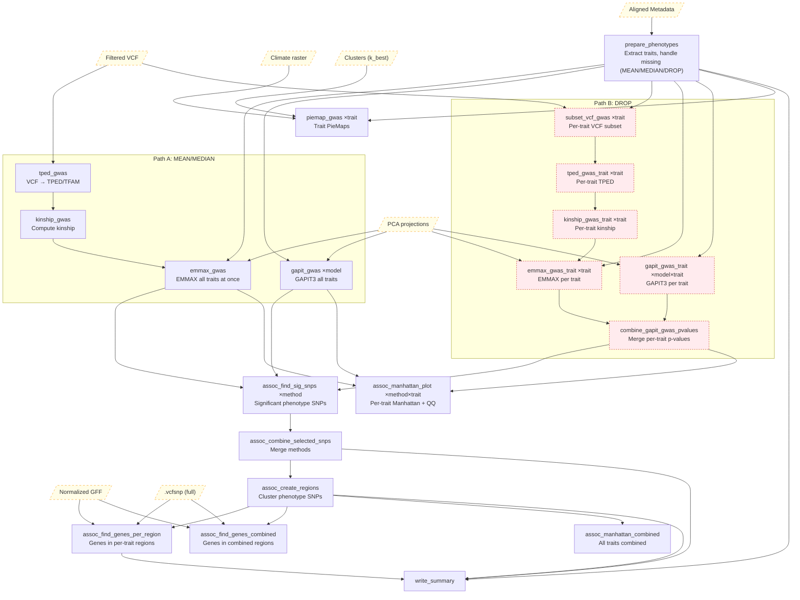
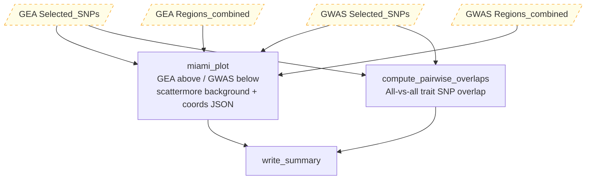
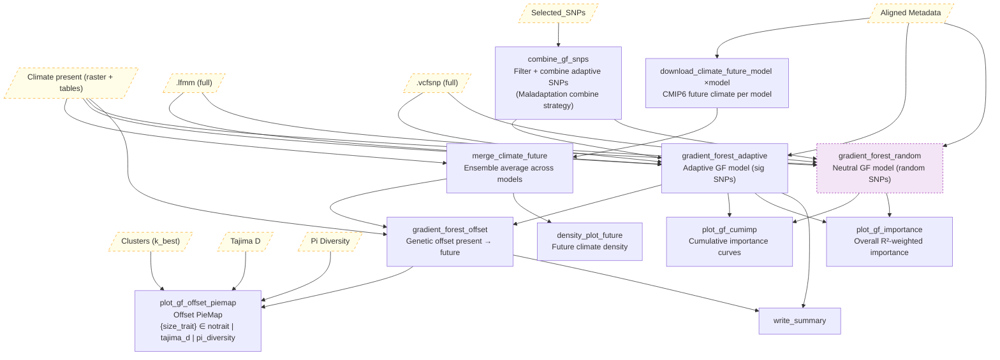

# ADAPTOGENE Pipeline DAGs

## Overview

Each mode is run separately via `--config mode=<MODE>`.

> **Regionplot, GO enrichment, haplotype scanning, and haplotype visualization** are computed on-demand in the Shiny dashboard rather than as pipeline modes.

---

## Detailed Rule DAGs

Node labels match Snakefile rule names exactly. `×N` indicates wildcard-expanded rules.

### Processing Mode — VCF filtering, LD pruning, format conversion

**Key outputs**:
- `_work/.../filtered.vcf`, `_work/.../ld.../pruned.vcf` — filtered + LD-pruned VCFs
- `_work/.../ld.../{name}.geno`, `.lfmm`, `.vcfsnp` — LEA format conversions
- `Processing/tables/metadata.tsv` — aligned metadata (sample order matches VCF)
- `Processing/tables/sample_missing_stats.tsv` — per-sample missingness
- `_intermediate/annotation/normalized.gff3` — chr-stripped GFF

---

### PreStructure Mode — Population structure inference

**Key outputs**:
- `PreStructure/plots/pca.png/svg`, `tracy_widom.png/svg` — PCA scatter + eigenvalue test
- `PreStructure/plots/cross_entropy_K{start}-{end}.png/svg` — K selection guide
- `PreStructure/plots/K{k}/structure_K{k}.png/svg` — ancestry barplots (per K)
- `PreStructure/plots/K{k}/pca_structure_K{k}.png/svg` — PCA with ancestry pies
- `PreStructure/plots/K{k}/pop_diff_K{k}.png/svg` — population differentiation
- `PreStructure/tables/K{k}/clusters_K{k}.tsv` — Q-matrices per K

---

### Structure Mode — Imputation, climate, population statistics

**Purple nodes** = optional, require `Population.calc_stats: true`; LD decay always runs.

**Key outputs**:
- `climate/rasters/present/` — WorldClim bioclim rasters (.tif)
- `climate/tables/present/climate_present_{all,site,site_scaled}.tsv`
- `climate/plots/density_plot_present.png/svg`, `correlation_heatmap.png/svg`
- `Structure/plots/piemap/piemap_{bio}.png/svg` + `zoom/` variants
- `Structure/plots/piemap/{tajima_d,pi_diversity}/piemap_{bio}_{metric}.png/svg` (optional)
- `Structure/tables/pop_stats/tajima_d_by_pop.tsv`, `pi_diversity_by_pop.tsv`, `ibd_raw.tsv`, `ibd_pairs.tsv`, `amova.tsv`
- `Structure/plots/pop_stats/mantel_test.png/svg`, `amova.png/svg`
- `Structure/plots/ld_decay/ld_decay_genome_wide.png/svg`, `ld_decay_per_chr.png/svg`, `ld_decay_per_pop.png/svg`

---

### GEA Mode — Climate association analysis

> **GO enrichment and regionplot** are computed on-demand in the Shiny dashboard (GEA tab → region detail). Results persist to `GEA/plots/enrichment/` and `GEA/tables/enrichment/`.

**Key outputs**:
- `GEA/GAPIT_native_output/{model}/` — raw GAPIT output files
- `GEA/tables/methods/{method}/{method}_pvalues_K{k}.tsv` — per-method p-values
- `GEA/tables/methods/{method}/{method}_sig_snps_{adjust}.tsv` — significant SNPs per method
- `GEA/tables/selected_snps.tsv` — merged across methods
- `GEA/tables/regions_per_trait.tsv`, `regions_combined.tsv` — clustered regions
- `GEA/tables/genes_per_region.tsv`, `genes_per_region_collapsed.tsv`, `genes_combined.tsv`
- `GEA/plots/manhattan/{method}/manhattan_{trait}_K{k}_{adjust}.png/svg`
- `GEA/plots/manhattan/{method}/qq_{trait}_K{k}_{adjust}.png/svg`
- `GEA/plots/manhattan/combined/manhattan_combined_K{k}.png/svg`

---

### GWAS Mode — Association on phenotypic traits

**Red nodes** = DROP path only (per-trait subsetting). Either Path A or Path B runs, not both.

> **GO enrichment** is computed on-demand in the Shiny dashboard (GWAS tab → region detail). Results persist to `GWAS/plots/enrichment/` and `GWAS/tables/enrichment/`.

**Key outputs** (same structure as GEA but under `GWAS/`):
- `GWAS/tables/methods/{method}/` — per-method p-values and significant SNPs
- `GWAS/tables/selected_snps.tsv`, `regions_per_trait.tsv`, `regions_combined.tsv`
- `GWAS/tables/genes_per_region.tsv`, `genes_combined.tsv`
- `GWAS/plots/manhattan/{method}/manhattan_{trait}_K{k}_{adjust}.png/svg`
- `GWAS/plots/manhattan/combined/manhattan_combined_K{k}.png/svg`
- `GWAS/plots/piemap/phenomap_{trait}.png/svg` + `zoom/`

---

### GEAxGWAS Mode — GEA + GWAS overlap analysis

> **Region overlap detection, gene annotation, and GO enrichment** for overlapping regions are computed on-demand in the Shiny dashboard (GEAxGWAS tab). The Shiny app dynamically computes regions from the merged GEA+GWAS SNP set with user-configurable overlap bounds (Union / Intersection / GEA-only / GWAS-only).

**Key outputs**:
- `GEAxGWAS/plots/miami_combined_K{k}.png/svg` — static Miami background
- `GEAxGWAS/plots/miami_combined_K{k}_background.png` — scattermore non-sig layer
- `GEAxGWAS/plots/miami_combined_K{k}_coords.json` — sig SNP coordinates for plotly overlay
- `GEAxGWAS/tables/pairwise_collapsed_snps.tsv` — per-trait SNP sets
- `GEAxGWAS/tables/pairwise_overlap_table.tsv` — pairwise overlap scores

---

### Maladaptation Mode — Gradient Forest and genetic offset

**Purple nodes** = optional (random model requires `Maladaptation.methods.gradient_forest.random_model: true`; `tajima_d`/`pi_diversity` piemaps require `Population.calc_stats: true`)

**Key outputs** (under `Maladaptation/{plots,tables}/gradient_forest/{run_label}_{spatial_tag}/`):
- `climate/tables/future/climate_future_year{Y}_ssp{S}_{site,all}.tsv`
- `climate/rasters/future/` — CMIP6 future rasters (.tif)
- `climate/plots/density_plot_future_ssp{S}_{Y}.png/svg`
- `Maladaptation/plots/gradient_forest/{suffix}/cumulative_importance.png/svg`
- `Maladaptation/plots/gradient_forest/{suffix}/overall_importance.png/svg`
- `Maladaptation/plots/gradient_forest/{suffix}/genetic_offset_piemap[_{tajima_d,pi_diversity}].png/svg`
- `Maladaptation/tables/gradient_forest/{suffix}/genetic_offset_{map,site}.tsv`
